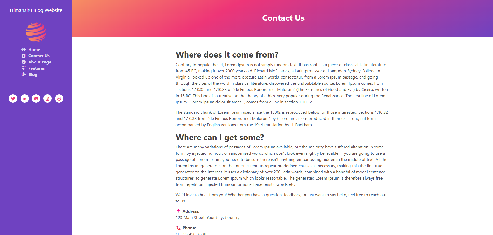
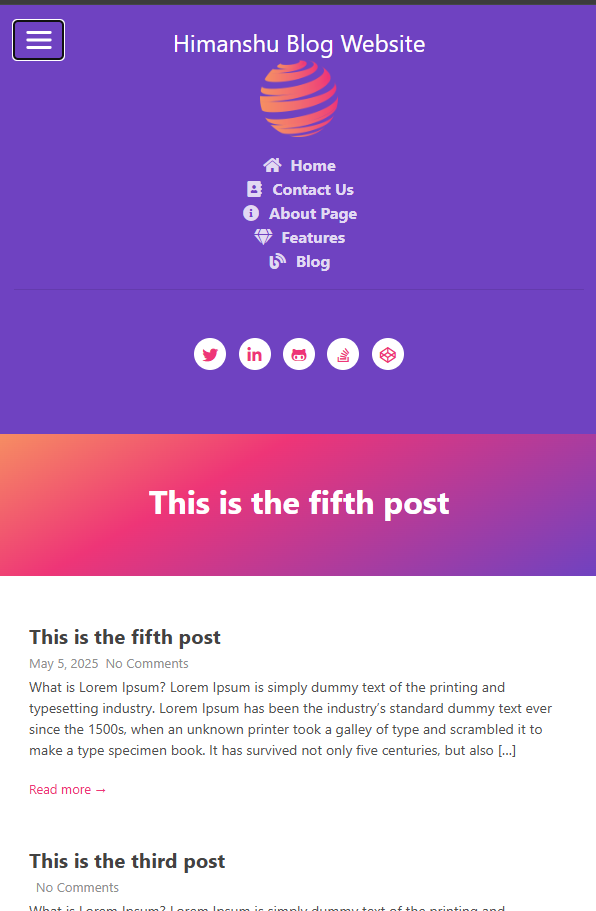

<h1> WordPress Blog Website with Customization Template and Theme Integration</h1>

<h2>WordPress Frontend Features</h2>
<ul>
  <li>Homepage: An engaging landing page to showcase the latest posts and categories.</li>
  <li>Contact Us: A streamlined form to help users get in touch with you.</li>
  <li>About Us: A space to tell your story and build trust with visitors.</li>
  <li>Features: Highlights of your unique offerings and benefits.</li>
  <li>Blog: A customizable blog section for regular content updates.</li>
</ul>

<h2>WordPress (Admin Panel)</h2>
<ul>
  <li>Add Post: Easily create and publish blog posts with rich content options.</li>
  <li>Add Pages: Manage pages like About, Contact, or any custom page.</li>
  <li>Widgets: Add dynamic elements to your website effortlessly.</li>
</ul>

<h1>Homepage</h1>

The homepage is designed with custom theme integration, ensuring a clean layout and easy navigation that delivers a strong first impression.

<h1>Contact Us</h1>

The Contact Us page features a customizable form, allowing you to capture inquiries and engage effectively with your visitors.

<h1>About Us</h1>

Share your brand story, mission, and values with a beautifully crafted About Us page powered by custom theme integration.

<h1>Features</h1>

Showcase your unique selling points and services with a highly flexible Features page designed through custom theme layouts and elements.

<h1>Blog</h1>

The blog section supports easy publishing, rich formatting, and full customization, creating an engaging reading experience for visitors.

<h1>Blog Comments</h1>

Allow your readers to leave feedback and engage with your content through an intuitive and user-friendly comments section.

<h1>Blog Post Mobile Responsive</h1>

The custom theme ensures perfect responsiveness across all devices, offering a seamless user experience on mobile, tablet, and desktop.

<h1>Blog Mobile Menu Integration</h1>

Our mobile-optimized menu ensures smooth and easy navigation, making browsing your site simple and user-friendly across devices.

<h1>Blog Mobile View Pagination</h1>

Effortless pagination for mobile users enhances readability and content accessibility, improving overall engagement on your blog.

<h1>Theme Integration and Customization</h1>

<h2>Seamless Theme Integration</h2>

Our solution includes full integration of a customizable WordPress theme, ensuring that the design matches your brand identity and delivers a premium look and feel.

<h2>Custom Theme Customization</h2>
<ul>
  <li><strong>Color Schemes</strong>: Adjust colors to perfectly match your branding.</li>
  <li><strong>Typography</strong>: Choose from a variety of fonts to enhance readability and design appeal.</li>
  <li><strong>Layout Options</strong>: Create flexible, dynamic page layouts with customized grids, sections, and widgets.</li>
  <li><strong>Logo & Branding</strong>: Easily upload and manage your logo and brand elements for a cohesive look.</li>
</ul>

<h2>Why Theme Customization is Important</h2>

Theme customization goes beyond aesthetics — it creates a unique identity for your website, aligning it with your business goals and enhancing your audience's experience. Through tailored layouts, personalized features, and brand-consistent design, we ensure your blog stands out in a crowded digital landscape.

<h2>Contact Us for Customization Options</h2>

Ready to bring your vision to life? <strong>Contact us</strong> today to learn how we can integrate a custom theme and create a stunning, functional WordPress blog tailored just for you.

</body>
