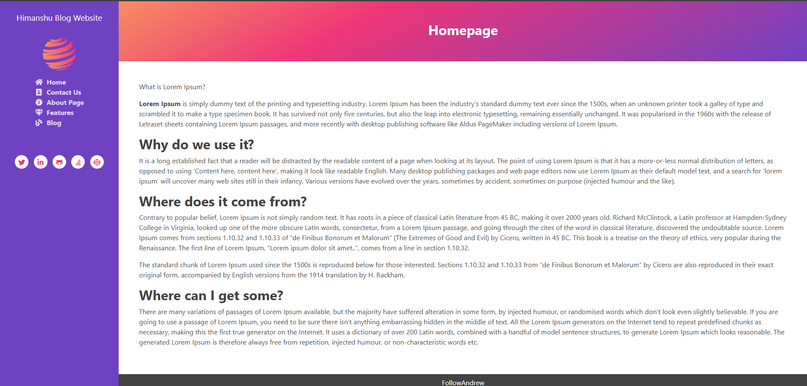
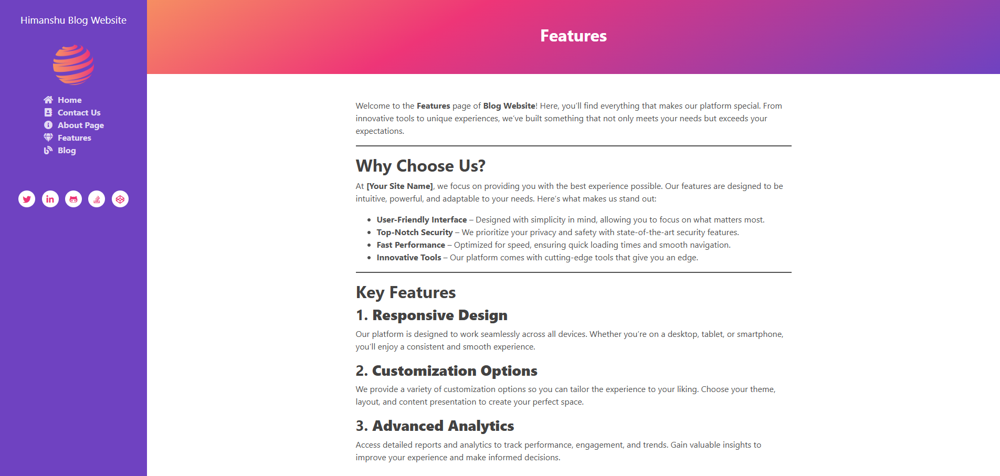
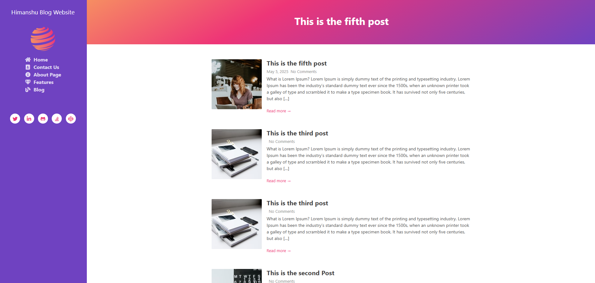
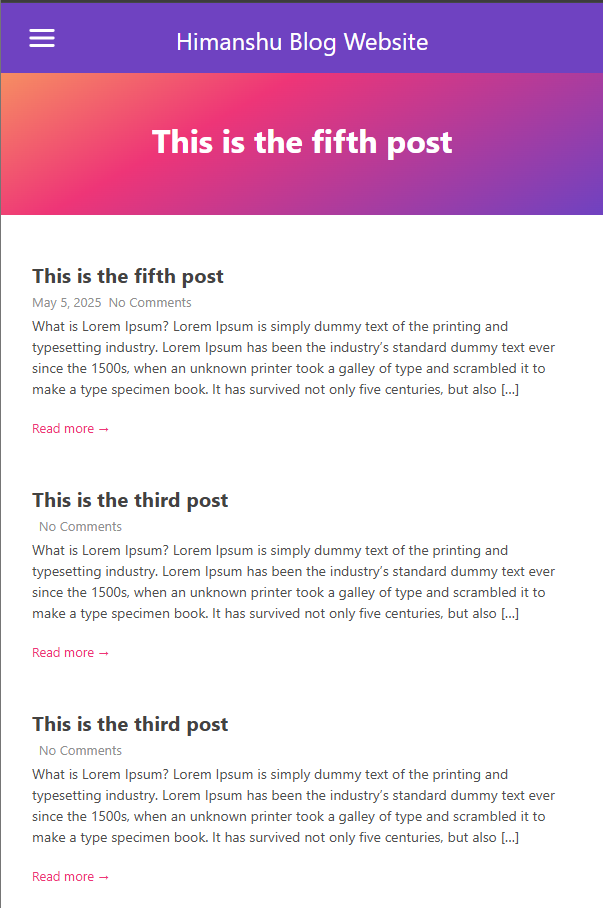
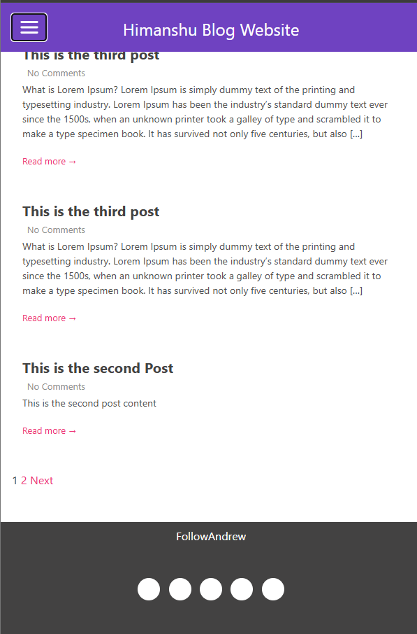

<h1> WordPress Blog Website with Customization Template and Theme Integration</h1>

<h2>WordPress Frontend Features</h2>
<ul>
  <li>Homepage: An engaging landing page to showcase the latest posts and categories.</li>
  <li>Contact Us: A streamlined form to help users get in touch with you.</li>
  <li>About Us: A space to tell your story and build trust with visitors.</li>
  <li>Features: Highlights of your unique offerings and benefits.</li>
  <li>Blog: A customizable blog section for regular content updates.</li>
</ul>

<h2>WordPress (Admin Panel)</h2>
<ul>
  <li>Add Post: Easily create and publish blog posts with rich content options.</li>
  <li>Add Pages: Manage pages like About, Contact, or any custom page.</li>
  <li>Widgets: Add dynamic elements to your website effortlessly.</li>
</ul>

<h1>Homepage</h1>

<h2>Homepage Overview</h2>

The homepage is designed with custom theme integration, ensuring a clean layout and easy navigation that delivers a strong first impression.

<h1>Contact Us</h1>

<h1>About Us</h1>

<h1>Features</h1>

<h1>Blog</h1>

<h1>Blog Comments</h1>

<h1>Blog Post Mobile Responsive</h1>

<h1>Blog Mobile Menu Responsive</h1>

<h1>Blog Mobile View Pagination</h1>

